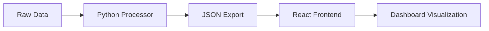

# Client Management Dashboard 🎯

A robust full-stack client relationship management analytics dashboard built with React and Python, providing real-time insights into client interactions, task management, and communication metrics. 📊

## 🚀 Features

- **Real-time Analytics Dashboard** 📈
  - Task status distribution visualization
  - Communication patterns analysis
  - Meeting metrics tracking
  - Client engagement monitoring

- **Data Processing Engine** ⚙️
  - Automated data aggregation
  - Statistical analysis
  - Performance metrics calculation
  - Trend identification algorithms

- **Interactive Visualizations** 🎨
  - Responsive charts and graphs
  - Dynamic data filtering
  - Real-time updates
  - Cross-platform compatibility

## 🔧 Tech Stack

### Frontend
- **React 18** - UI library
- **Recharts** - Data visualization library
- **Tailwind CSS** - Utility-first CSS framework
- **shadcn/ui** - Component library
- **Lucide React** - Icon library

### Backend
- **Python 3.9+** - Core processing
- **Pandas** - Data manipulation
- **NumPy** - Numerical computations
- **JSON** - Data interchange format
- **MySQL** - Database management

## 📦 Installation

1. **Clone the repository**
```bash
git clone https://github.com/yourusername/client-management-dashboard.git
cd client-management-dashboard
```

2. **Install frontend dependencies**
```bash
cd frontend
npm install
```

3. **Install Python dependencies**
```bash
cd backend
pip install -r requirements.txt
```

## 🚀 Quick Start

1. **Start the Python backend**
```bash
python client-analysis.py
```

2. **Launch the React frontend**
```bash
npm run dev
```

3. **Access the dashboard**
```
Navigate to http://localhost:3000
```

## 📊 Data Processing

The system processes several key data structures:

- `Client Data`: Basic client information and metadata
- `Task Records`: Project and task tracking information
- `Meeting Logs`: Client interaction records
- `Communication Data`: Multi-channel communication tracking

# SQL Analytics Components 📈

## Client Demographics Analysis

The system provides comprehensive SQL analytics for generating client insights. Below are the core analytical queries used in the dashboard:

### 1. Basic Client Metrics
```sql
-- Basic client count for overall system metrics
SELECT 
    COUNT(*) as total_clients 
FROM clients;
```

### 2. Email Domain Distribution
```sql
-- Analyzes the distribution of email domains across client base
SELECT 
    SUBSTRING_INDEX(Email_Phone, '@', -1) as domain,
    COUNT(*) as count,
    ROUND(COUNT(*) * 100.0 / (SELECT COUNT(*) FROM clients), 2) as percentage
FROM clients
WHERE Email_Phone LIKE '%@%'
GROUP BY domain
ORDER BY count DESC;
```

### 3. Company Type Analysis
```sql
-- Categorizes clients by company type (Ltd, Inc, PLC, etc.)
SELECT 
    CASE 
        WHEN Client_Name LIKE '% Ltd%' THEN 'Ltd'
        WHEN Client_Name LIKE '% Inc%' THEN 'Inc'
        WHEN Client_Name LIKE '% PLC%' THEN 'PLC'
        WHEN Client_Name LIKE '% LLC%' THEN 'LLC'
        WHEN Client_Name LIKE '% Group%' THEN 'Group'
        ELSE 'Other'
    END as company_type,
    COUNT(*) as count
FROM clients
GROUP BY company_type
ORDER BY count DESC;
```

### 4. Professional Title Distribution
```sql
-- Analyzes the distribution of professional titles among contact persons
SELECT 
    CASE 
        WHEN Contact_Person LIKE '% PhD%' THEN 'PhD'
        WHEN Contact_Person LIKE '% MD%' THEN 'MD'
        WHEN Contact_Person LIKE '% DVM%' THEN 'DVM'
        ELSE 'No Title'
    END as title,
    COUNT(*) as count
FROM clients
GROUP BY title
ORDER BY count DESC;
```

## Usage Examples

### Basic Demographics Query
```bash
mysql -u username -p database_name < queries/basic_metrics.sql
```

### Running All Analytics
```bash
./run_analytics.sh
```

## Implementation Notes

1. All queries are optimized for performance with appropriate indexing:
   ```sql
   CREATE INDEX idx_email ON clients(Email_Phone);
   CREATE INDEX idx_client_name ON clients(Client_Name);
   CREATE INDEX idx_contact_person ON clients(Contact_Person);
   ```

2. Query Results Handling:
   - Results are cached for 15 minutes
   - Real-time updates available via API endpoint
   - Export functionality in CSV/JSON formats

## Database Schema Reference

```sql
CREATE TABLE clients (
    id INT PRIMARY KEY AUTO_INCREMENT,
    Client_Name VARCHAR(255) NOT NULL,
    Email_Phone VARCHAR(255),
    Contact_Person VARCHAR(255),
    created_at TIMESTAMP DEFAULT CURRENT_TIMESTAMP,
    updated_at TIMESTAMP DEFAULT CURRENT_TIMESTAMP ON UPDATE CURRENT_TIMESTAMP
);
```

## Current Analytics Distribution (as of January 2025)

| Category | Metric | Percentage |
|----------|--------|------------|
| Email Domains | Gmail | 26% |
| | Yahoo | 24% |
| | Hotmail | 20% |
| | Others | 30% |
| Company Types | Ltd | 24% |
| | Inc | 16% |
| | Group | 10% |
| | PLC | 6% |
| | LLC | 4% |
| | Other | 40% |
| Professional Titles | No Title | 94% |
| | PhD | 2% |
| | MD | 2% |
| | DVM | 2% |

## Integration Guide

1. Import the SQL module:
```python
from src.analytics import SQLAnalytics

# Initialize analytics
analytics = SQLAnalytics(db_config)

# Run specific analysis
results = analytics.run_company_distribution()
```

2. API Endpoints:
```bash
GET /api/v1/analytics/client-distribution
GET /api/v1/analytics/email-domains
GET /api/v1/analytics/company-types
GET /api/v1/analytics/professional-titles
```

## 🔄 Data Flow



## 📈 Visualization Components (Dashboard)

1. **Key Metrics Cards**
   - Total Clients Counter 
   - Active Tasks Monitor
   - Scheduled Meetings Tracker
   - Communication Volume Indicator


2. **Chart Components**
   - Task Status Distribution (Pie)


   - Communication Types (Bar)


   - Meeting Distribution (Pie)


   - Priority Analysis (Bar)


## ⚙️ Configuration

The dashboard can be configured through the following files:

```plaintext
/config
  ├── dashboard.config.js    # Dashboard layout and components
  ├── charts.config.js       # Chart specifications
  └── api.config.js          # API endpoints and settings
```

## 📱 Responsive Design

The dashboard is fully responsive with breakpoints:
- 📱 Mobile: < 640px
- 📱 Tablet: 768px - 1024px
- 💻 Desktop: > 1024px

## 🔐 Security

- Data encryption in transit
- Secure API endpoints
- Input sanitization
- XSS protection
- CSRF protection

## 🔄 Updates and Maintenance

To update the dashboard:

1. Pull latest changes
```bash
git pull origin main
```

2. Update dependencies
```bash
npm update        # Frontend
pip install -U -r requirements.txt  # Backend
```

## 👥 Contributing

1. Fork the repository
2. Create your feature branch: `git checkout -b feature/YourFeature`
3. Commit changes: `git commit -m 'Add YourFeature'`
4. Push to branch: `git push origin feature/YourFeature`
5. Submit a pull request

## 🖍️ License

This project is licensed under the MIT License - see the [LICENSE.md](LICENSE.md) file for details.
