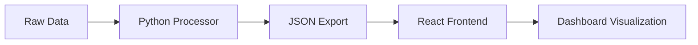

# Client Management Dashboard 🎯

A robust full-stack client relationship management analytics dashboard built with React and Python, providing real-time insights into client interactions, task management, and communication metrics. 📊

## 🚀 Features

- **Real-time Analytics Dashboard** 📈
  - Task status distribution visualization
  - Communication patterns analysis
  - Meeting metrics tracking
  - Client engagement monitoring

- **Data Processing Engine** ⚙️
  - Automated data aggregation
  - Statistical analysis
  - Performance metrics calculation
  - Trend identification algorithms

- **Interactive Visualizations** 🎨
  - Responsive charts and graphs
  - Dynamic data filtering
  - Real-time updates
  - Cross-platform compatibility

## 🔧 Tech Stack

### Frontend
- **React 18** - UI library
- **Recharts** - Data visualization library
- **Tailwind CSS** - Utility-first CSS framework
- **shadcn/ui** - Component library
- **Lucide React** - Icon library

### Backend
- **Python 3.9+** - Core processing
- **Pandas** - Data manipulation
- **NumPy** - Numerical computations
- **JSON** - Data interchange format

## 📦 Installation

1. **Clone the repository**
```bash
git clone https://github.com/yourusername/client-management-dashboard.git
cd client-management-dashboard
```

2. **Install frontend dependencies**
```bash
cd frontend
npm install
```

3. **Install Python dependencies**
```bash
cd backend
pip install -r requirements.txt
```

## 🚀 Quick Start

1. **Start the Python backend**
```bash
python client-analysis.py
```

2. **Launch the React frontend**
```bash
npm run dev
```

3. **Access the dashboard**
```
Navigate to http://localhost:3000
```

## 📊 Data Processing

The system processes several key data structures:

- `Client Data`: Basic client information and metadata
- `Task Records`: Project and task tracking information
- `Meeting Logs`: Client interaction records
- `Communication Data`: Multi-channel communication tracking

## 🔄 Data Flow



## 📈 Visualization Components (Dashboard)

1. **Key Metrics Cards**
   - Total Clients Counter 
   - Active Tasks Monitor
   - Scheduled Meetings Tracker
   - Communication Volume Indicator


2. **Chart Components**
   - Task Status Distribution (Pie)


   - Communication Types (Bar)


   - Meeting Distribution (Pie)


   - Priority Analysis (Bar)


## ⚙️ Configuration

The dashboard can be configured through the following files:

```plaintext
/config
  ├── dashboard.config.js    # Dashboard layout and components
  ├── charts.config.js       # Chart specifications
  └── api.config.js          # API endpoints and settings
```

## 📱 Responsive Design

The dashboard is fully responsive with breakpoints:
- 📱 Mobile: < 640px
- 📱 Tablet: 768px - 1024px
- 💻 Desktop: > 1024px

## 🔐 Security

- Data encryption in transit
- Secure API endpoints
- Input sanitization
- XSS protection
- CSRF protection

## 🔄 Updates and Maintenance

To update the dashboard:

1. Pull latest changes
```bash
git pull origin main
```

2. Update dependencies
```bash
npm update        # Frontend
pip install -U -r requirements.txt  # Backend
```

## 👥 Contributing

1. Fork the repository
2. Create your feature branch: `git checkout -b feature/YourFeature`
3. Commit changes: `git commit -m 'Add YourFeature'`
4. Push to branch: `git push origin feature/YourFeature`
5. Submit a pull request

## 🖍️ License

This project is licensed under the MIT License - see the [LICENSE.md](LICENSE.md) file for details.
